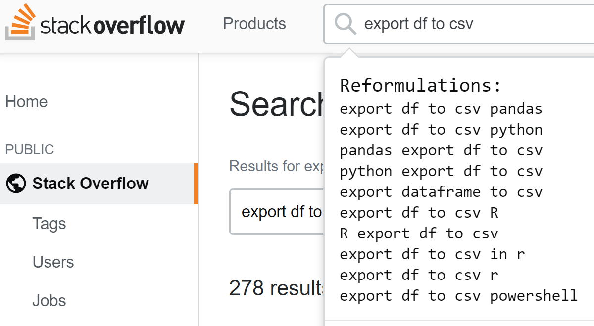
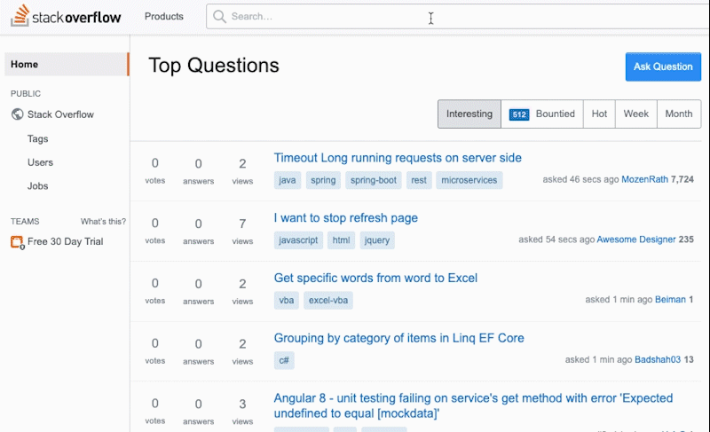

# Software spEcific QUEry Reformulation (SEQUER)

## Tampermonkey plugin

### Download and install

You can use this [link](https://greasyfork.org/en/scripts/403083-query-reformulation-for-stack-overflow) to download and install the plugin for query reformulation on Stack Overflow.

### Instructions

1. Install this script.
2. Open Stack Overflow (<https://stackoverflow.com>) and click the input box.
3. Type in the query you want to reformulate.
4. Press Ctrl + Q to get reformulated result.

P.S.:
For mac users, you should use the "ctrl" key on the right side of "fn" instead of the "command" key.

### Screenshots

## Query Reformulation Examples

Original Query | Google Prediction Service | seq2seq | SEQUER
---------|----------|---------|---------
``heroku dash`` | ``heroku dashboard`` ``heroku dashboard github`` ``heroku dashboard logs`` ``heroku dash deployment`` ``heroku dashboard console``  | ``heroku dash`` ``heroku dash python`` ``heroku`` ``heroku dash ubuntu`` ``heroku dash node``  | **``heroku dash plotly``** ``heroku dash vue`` ``heroku dash options`` ``heroku dash save`` ``heroku dash git``  | ``heroku dash plotly``
``[excel-formula] buscarv`` | ``excel formula buscarv`` ``excel formula buscarv en otra hoja`` ``excel formula buscarv en ingles`` ``excel formula buscarv ejemplo`` ``excel formula buscarv varios resultados``  | ``[excel-formula] business`` ``[excel-formula]`` ``[excel-formula] version`` ``[excel-formula] employee`` ``[excel-formula] s1.2``  | ``[excel-formula] business`` ``[excel-formula] deploy`` ``[excel-formula] buscarv failed`` **``[excel-formula] vlookup``** ``[excel-formula] business business``  | ``[excel-formula] vlookup``
``dynamodb query not null`` | ``dynamodb query null`` ``dynamodb keyconditionexpression not null`` ``dynamodb query is null`` ``dynamodb not null query`` | ``dynamodb query not null`` ``dynamodb query null`` ``dynamodb query null not found`` ``dynamodb query not null sql`` ``dynamodb query``  | ``dynamodb query is not null`` ``dynamodb query null`` ``dynamodb query`` **``dynamodb query exists``** ``dynamodb query is null``  | ``dynamodb query exists``
``sql replace`` | ``sql replace regex`` ``sql replace null with 0`` ``sql replace wildcard`` ``sql replace part of string`` ``sql replace into``  | ``sql replace string`` ``sql replace`` ``sql replace replace`` ``sql replace date`` ``sql replace sql``  | ``sql replace string`` ``sql replace all`` ``sql replace date`` ``sql string replace`` **``oracle sql replace``**  | ``oracle sql replace``
``libtiff windows`` | ``libtiff windows visual studio`` ``libtiff windows 10`` ``libtiff windows 64 bit`` ``libtiff windows build`` ``libtiff windows installer``  | ``libtiff windows`` ``libtiff windows 10`` ``libtiff`` ``libtiff windows mac`` ``libtiff windows 7``  | ``libtiff windows c++`` ``libtiff windows c`` **``libtiff windows install``** ``libtiff`` ``libtiff windows android``  | ``libtiff windows install``
``how to apply fama-french model`` | ``how to use fama french model`` ``how to use fama french three factor model`` ``how to interpret fama french model`` ``how to estimate fama french model`` ``how to calculate fama french model``  | ``how to apply fmafrench`` ``how to apply submafations`` ``how to apply mafrench`` ``how to apply attribute`` ``how to apply fafrench``  | ``how to apply fama-french model in R`` ``apply fama-french model`` ``how to apply fama-french model in r`` **``fama-french model``** ``how to apply french model``  | ``fama-french model``
``while loops`` | ``while loops python`` ``while loops java`` ``while loops c++`` ``while loops matlab`` ``while loops javascript``  | ``while loops python`` ``while loops java`` ``while loops in python`` ``while loops in java`` ``while loops c#``  | ``while loops python`` ``while loops java`` ``while loops in java`` ``while loops in python`` **``python while loops``**  | ``python while loops``
``uninstall anaconda`` | ``uninstall anaconda3 mac`` ``uninstall anaconda in linux`` ``uninstall anaconda package`` ``uninstall anaconda macos`` ``uninstall anaconda3 windows``  | ``uninstall anaconda ubuntu`` ``uninstall anaconda`` ``uninstall anaconda mac`` ``uninstall anaconda linux`` ``uninstall anaconda windows``  | **``uninstall anaconda from ubuntu``** ``uninstall anaconda windows`` ``uninstall anaconda on windows`` ``uninstall anaconda in ubuntu`` ``uninstall anaconda windows 10``  | ``uninstall anaconda from ubuntu``
``python arguments`` | ``python arguments parser`` ``python arguments example`` ``python arguments command line`` ``python arguments list`` ``python arguments default value``  | ``python arguments`` ``python find arguments`` ``python list arguments`` ``python arguments arguments`` ``python function arguments``  | ``python command arguments`` **``python command line arguments``** ``python arguments parsing`` ``python arguments bat`` ``python script arguments``  | ``python command line arguments``
``erlang_home not set corrently`` | ``erlang_home not set correctly`` ``solarwinds erlang_home not set correctly`` ``rabbitmq erlang_home not set correctly`` ``erlang_home not set correctly windows`` | ``lang_set not corrupt`` ``lang_set not cortly`` ``erlang_set not corrupt`` ``lang_language not set`` ``lang_change not set``  | **``erlang_home not set``** ``error home not set corrently`` ``erlang_home not set corrently`` ``erlang_home not set corrently maven`` ``erlang_home corrently``  | ``erlang_home not set``
``importar do excel para acces`` | ``exportar do excel para access`` ``importar do excel para o access`` ``importar dados do excel para access`` ``como exportar do excel para access`` ``exportar do excel para o access``  | ``import excel vba`` ``import csv excel`` ``import excel vba excel`` ``import r excel`` ``import doexcel vba``  | ``importar do excel para`` ``import excel para acces`` ``importar excel para`` **``importar do excel``** ``how to import excel para acces``  | ``importar do excel``
``Git bonnes pratiques`` | ``git les bonnes pratiques`` | ``Git conditions`` ``Git multiple conditions`` ``Git bons nets`` ``Git multiple suites`` ``Git bons nees``  | ``Git bonnes`` ``Git bonnes product`` ``Git bonnes products`` **``Git best practices``** ``Git bonnes projects``  | ``Git best practices``
``Keystone js REST api`` | ``keystone js api`` | ``Keystone js rest api`` ``Keystone js`` ``Keystone js api`` ``Keystone js REST api`` ``Keystone javascript``  | ``Keystone api`` **``Keystone rest api``** ``Keystone REST api`` ``Keystone.js REST api`` ``Keystone js REST``  | ``Keystone rest api``
``how to unselect checkboxes using selenium java?`` | ``how to uncheck checkbox in selenium java`` ``how to uncheck checkbox using selenium webdriver`` ``how to uncheck checkbox in selenium webdriver c#`` ``how to uncheck checkbox in selenium webdriver python`` ``how to select and deselect checkbox using selenium webdriver python``  | ``how to select checkboxes using selenium webdriver`` ``how to select checkboxes using selenium java`` ``how to select checkboxes using selenium`` ``how to select uncheckboxes using selenium`` ``how to select uncheckboxes using selenium java``  | **``checkboxes using selenium java?``** ``how to unselect checkboxes using selenium java`` ``how to unselect checkboxes using selenium`` ``checkboxes using selenium java`` ``how to unselect checkboxes using selenium java ?``  | ``checkboxes using selenium java?``
``How to make image asset`` | ``how to create image asset in android studio`` ``how to create image assets`` ``how to use image asset in android studio`` ``android studio create image asset`` ``create image asset android studio``  | ``How to make image asset`` ``How to make image asset swift`` ``How to make image asset python`` ``How to make image asset android`` ``How to make image asset c++``  | ``How to make image asset android`` ``How to make image asset swift`` **``How to make image asset android studio``** ``How to make image asset in swift`` ``How to make image asset ionic``  | ``How to make image asset android studio``
``Base table not found`` | ``base table not found 259 invalid table name`` ``base table not found laravel`` ``openoffice base table not found in statement`` ``libreoffice base table not found in statement`` ``drupal base table not found``  | ``Base table not found`` ``Base table not found laravel`` ``Base table not found oracle`` ``"Base table not found"`` ``Base table not found python``  | ``laravel Base table not found`` ``Base table not found laravel`` ``Basetable not found laravel`` ``magento Base table not found`` **``Base table not found in laravel``**  | ``Base table not found in laravel``
``fully connected layer`` | ``fully connected layer pytorch`` ``fully connected layer keras`` ``fully connected layer cnn`` ``fully connected layer tensorflow`` ``fully connected layer matlab``  | ``fully connected layer android`` ``fully connected layer`` ``connected layer`` ``fully connected layer python`` ``fully connected layer swift``  | ``fully connected layer android`` ``why fully connected layer`` **``why we need fully connected layer``** ``fully connected layer chrome`` ``fully connected layer debug``  | ``why we need fully connected layer``
``merge python`` | ``merge python dictionaries`` ``merge python dataframes`` ``merge python lists`` ``merge python left join`` ``merge python files into one``  | ``merge python`` ``merge python python`` ``merge merge python`` ``merge python list`` ``merge list python``  | ``merge list python`` **``merge dataframe python``** ``merge lists python`` ``merge csv python`` ``merge dataframes python``  | ``merge dataframe python``
``c# client server communication framework`` | ``c# client server communication`` | ``c# client server communication`` ``c# client communication`` ``c# server client communication`` ``c# client communication server`` ``c# client framework communication``  | **``c# communication framework``** ``c# c# communication framework`` ``c# client server communication`` ``c# .net communication framework`` ``.net communication framework``  | ``c# communication framework``
``pyspark choose coumns`` | ``pyspark choose columns`` ``pyspark join choose columns`` ``pyspark selecting columns`` ``select columns in pyspark`` ``how to select columns in pyspark``  | ``pyspark choose columns`` ``pyspark compare columns`` ``pyspark sum columns`` ``pyspark choose column`` ``pyspark copy columns``  | ``pyspark choose columns`` ``pyspark coumns`` ``spark choose columns`` ``pyspark chooser columns`` **``pyspark select columns``**  | ``pyspark select columns``
``fatal error: 'stdio.h' file not found`` | ``fatal error 'stdio.h' file not found`` ``fatal error 'stdio.h' file not found catalina`` ``fatal error 'stdio.h' file not found mojave`` ``fatal error 'stdio.h' file not found r`` ``fatal error 'stdio.h' file not found clang``  | ``fatal error: 'stdio.h' file not found`` ``fatal error: 'dio.h' file not found`` ``fatal error: 'dib.h' file not found`` ``fatal error: 'dist.h' file not found`` ``fatal error: 'dio.h' not found``  | **``'stdio.h' file not found``** ``caffe fatal error: 'stdio.h' file not found`` ``fatal error: 'stdio.h' file not found ubuntu`` ``fatal error: 'stdio.h' file not found osx`` ``fatal error: 'stdio.h' file not found caffe``  | ``'stdio.h' file not found``
``pyplot axis`` | ``pyplot axis label`` ``pyplot axis range`` ``pyplot axis limits`` ``pyplot axis equal`` ``pyplot axis title``  | ``pyplot axis label`` ``pyplot axis`` ``pyplot axis axis`` ``pyplot axis plot`` ``pyplot axis labels``  | **``pyplot axis values``** ``pyplot axis label`` ``pyplot axis range`` ``pyplot axis size`` ``pyplot axis ticks``  | ``pyplot axis values``
...|...|...|...

For more examples, please refer to [this](https://github.com/bytepaper/sequer/blob/master/examples.md) file.
